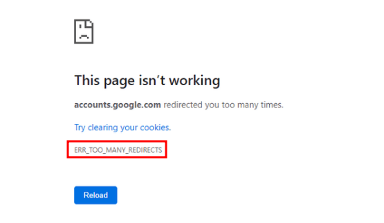

## Parte 3

El certificado del sitio web proyecto9bastionado.duckdns.org es considerado válido y seguro tras comprobarlo mediante la página web <https://www.ssllabs.com/ssltest/analyze.html?d=proyecto9bastionado.duckdns.org> por varios motivos:

**1. Alta Calificación de Seguridad (A)**: Indica una configuración de seguridad muy buena.

**2. Soporte de Protocolos Seguros**: Usa TLS 1.3 y TLS 1.2, excluyendo versiones antiguas y menos seguras.

**3. Certificado Fuerte**: Utiliza una clave robusta (EC 256 bits) y un algoritmo seguro (SHA256 con RSA).

**4. Cadena de Confianza Completa**: Incluye todos los certificados necesarios hasta la CA raíz, sin problemas en la cadena.

**5. Transparencia y No Revocación**: El certificado es transparente y no ha sido revocado.

**6. Protección Contra Ataques Comunes**: Configurado para proteger contra vulnerabilidades conocidas y ataques como BEAST y POODLE.

**7. Cifrado Robusto**: Ofrece cifrados fuertes y Perfect Forward Secrecy, asegurando que las sesiones sean privadas y seguras.

ERR\_SSL\_VERSION\_OR\_CIPHER\_MISMATCH:

Este error indica que no hay un conjunto de cifrado común entre el navegador y el servidor, o que la versión del protocolo SSL/TLS no es compatible.

Causas Posibles:

- El servidor está configurado para usar una versión de SSL/TLS que el navegador no soporta.
- El servidor está configurado para usar conjuntos de cifrado que no son compatibles con el navegador.
- Un certificado SSL obsoleto que necesita ser actualizado.

ERR\_TOO\_MANY\_REDIRECTS:

Descripción: Este error ocurre cuando una página web intenta redirigirte a otra página, que luego te redirige de vuelta a la página original, creando un bucle de redirección infinito.

Causas Posibles:

\- Problemas con la configuración de redirección en el servidor web.

\- Cookies corruptas que interfieren con el proceso de redirección.

\- Errores en las reglas de reescritura de URL que causan redirecciones circulares.

ERR\_SSL\_PROTOCOL\_ERROR:

Este es un error general que indica que el navegador no puede establecer una conexión segura con el servidor.

Causas Posibles:

- Configuración incorrecta del SSL/TLS en el servidor.
- Soporte obsoleto o inadecuado para ciertos protocolos SSL/TLS por parte del servidor o el navegador.
- Un intermediario (como un firewall) está interfiriendo o bloqueando la conexión SSL/TLS

[ref1]: Aspose.Words.01340cf9-db5d-4ef9-9298-1e3d7311ed00.017.png
[ref2]: Aspose.Words.01340cf9-db5d-4ef9-9298-1e3d7311ed00.018.png
